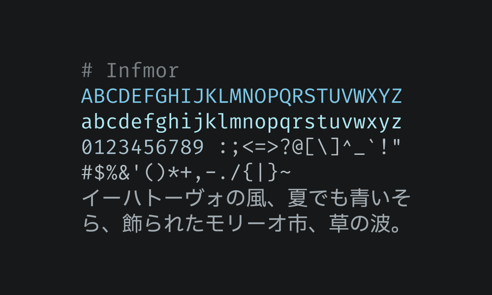
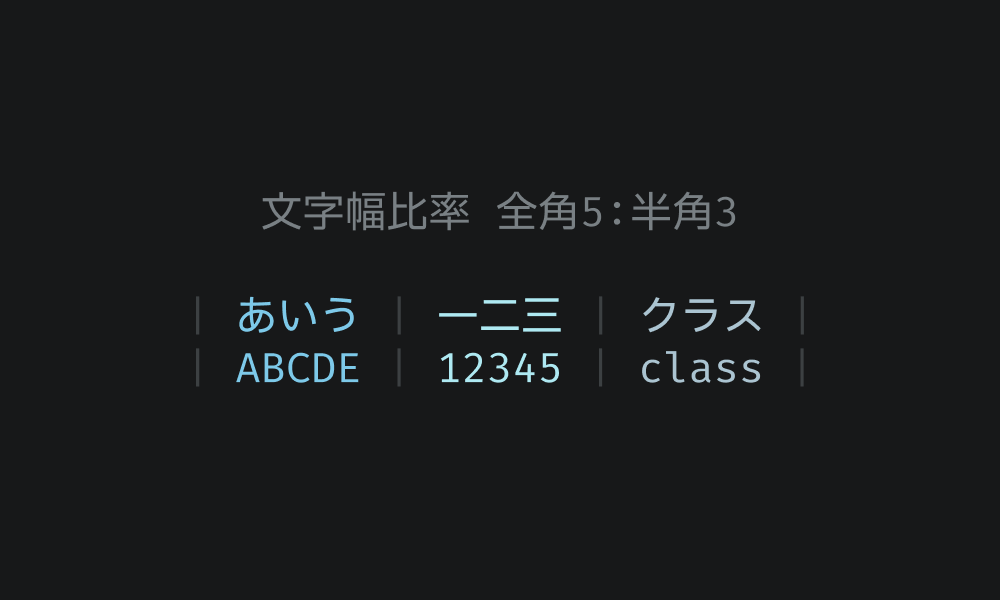

# Infmor

Infmor（インフモア）は、Fira Mono、Inconsolata、Moralerspaceからなるプログラミング用の等幅日本語フォントです。

## 仕様

### 英数字はFira Mono

- `0`をドット付きから斜線付きに変更

### 記号はInconsolata

- 視認性向上のため一部を微調整

### ASCII以外の部分はMoralerspace（JPDOC版のNeon）

- 日本語部分はIBM Plex Sans JP
- 全角と半角の文字幅比率が5:3
- 全角スペースの可視化など

## サンプル

